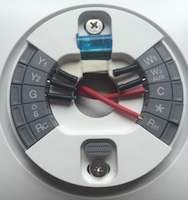
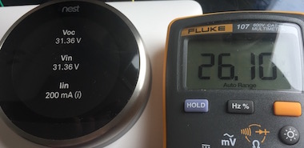
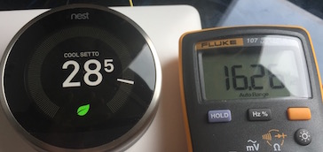
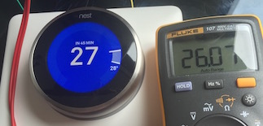
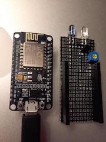
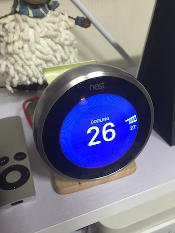
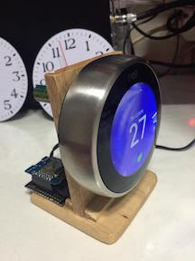
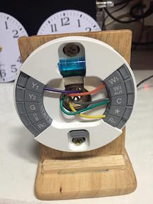
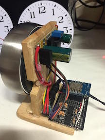

한국에서 NEST로 가정용 에어콘과 가스 보일러 제어
======================================

# Contents
- [개요](#개요)
- [장치](#장치)
- [케이블연결](#케이블연결)


## 개요
* mqtt/tls, esp8266를 이용하여 NEST와 연동용 브리지 구성
* 초기엔 NEST API로 구성
* 필요부품 구비되면 NEST 백플레이트의 신호를 감지하여 API에 의존하지 않고 제어
* 온도 설정은 API로 확인 필요

## 장치
* 에어콘 : LG WHISEN + esp8266 ir tx/rx
* 가스보일러 : 귀뚜라미(귀뚜라미 IOT 제어기 구매후 적용 예정)
* 홈서버(GW) : RPI(mqtt/tls-mosquitto, nodered)
* WIFI : WPA2 personal
* 24V AC 아답터


### 케이블연결
24V AC 아답터 | 백플레이트 
------------|----------
 |  

 24V IN | Cool off(0.8V with 5KR) | Cool on(24V with 5KR)
--------|----------|---------
 |  | 

esp8266 ir tx | nest
------------|----------
 | 

 bridge stand | back plate | bridge with HCLP-3700 and esp8266
--------|----------|---------
 |  | 


### Slack Incoming WebHooks

## NEST API
* Create product with read permission
* use [Python script](https://github.com/chaeplin/nest-in-korea/blob/master/get_access_token/get_access_token.py) to get access token and device_id of thermostat
- remove following
```
#include "/usr/local/src/ap_setting.h"
#include "/usr/local/src/nest_setting.h"
#include "/usr/local/src/slack_setting.h"
```

- change following
```
#define WIFI_SSID "xxxxxxx"
#define WIFI_PASSWORD "xxxxxxxx"
#define NEST_API_TOKEN "c.xxxxxxxx"
#define NEST_DEVICE_ID "xxxxxx_xxxxxxx-xxxxxx"
#define SLACK_IN_WEBHOOK "xxxx/xxxx/xxxxx"
```

